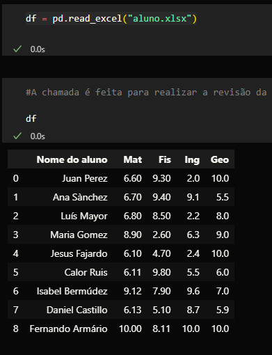
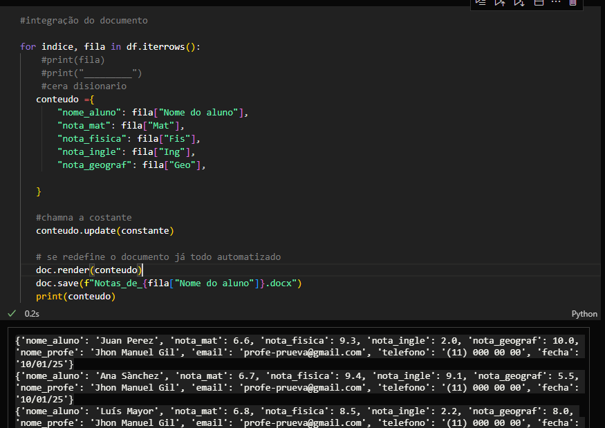

# pratica_basica_Python
 

 

# 10 rojetos Prácticos

 10 projetos incríveis que melhoram suas habilidades de programação, automatizam tarefas chatas e dão vida às suas ideias. Da automação de documentos do Word à criação de uma liga de futebol com Programação Orientada a Objetos (POO), cada projeto é projetado para desafiá-lo com aspectos essenciais do Python

----

## Projeto 1: Geração Automatizada de Relatórios de Notas de Alunos usando Python e Word/Excel

### Automatização de Documentos com Python
Objetivo do Projeto:
Automatizar a criação de documentos no formato Word contendo informações personalizadas, como notas de alunos, a partir de um arquivo Excel, utilizando o Python. Este projeto é útil para professores, escolas e instituições educacionais que desejam gerar relatórios personalizados de forma rápida e eficiente.

#### Descrição do Projeto: 

- Ferramentas e Tecnologias Utilizadas:
- Python: Linguagem principal para a automatização.
- Bibliotecas:
openpyxl: Para leitura e manipulação de arquivos Excel.
pandas: Para processamento e análise de dados extraídos do Excel.
docxtpl: Para geração de documentos Word com modelos pré-definidos.
datetime: Para manipulação de datas.
- Ambientes:
Google Colab: Testes e desenvolvimento inicial (se necessário).
Visual Studio Code: Ambiente local para codificação.
- Modelo de Documento:
Word (.docx): Utilização de um arquivo de modelo (plantin.docx) para estruturar os relatórios.

 

---
- Funcionamento do Projeto:

1. Configuração Inicial:

Importação das bibliotecas necessárias.
Definição de variáveis como nome do professor, e-mail, telefone e data atual.

2. Leitura do Arquivo Excel:

Utiliza pandas e openpyxl para abrir o arquivo aluno.xlsx, que contém os dados dos alunos, incluindo nome e notas em diferentes disciplinas.

3. Personalização dos Dados:

Criação de um dicionário que combina informações constantes (como nome do professor e data) com dados específicos de cada aluno (como nome e notas).

4. Geração dos Relatórios:

O modelo plantin.docx é preenchido dinamicamente com os dados de cada aluno.
Relatórios individuais são gerados no formato Notas_de_<Nome do Aluno>.docx.

5. Documento Geral:

Um arquivo geral chamado Prova.docx também é gerado, contendo as informações constantes, caso necessário.

 

----

### Saída do Projeto:

- Arquivos Word Personalizados: Relatórios individuais para cada aluno contendo:
 * Nome do aluno.
 * Notas de disciplinas (Matemática, Física, Inglês e Geografia).
 * Informações do professor (nome, e-mail e telefone).
 * Data de emissão do relatório.
*Facilidade de Uso: Apenas ao atualizar o arquivo aluno.xlsx, novos relatórios podem ser gerados automaticamente.

 

________________
________________